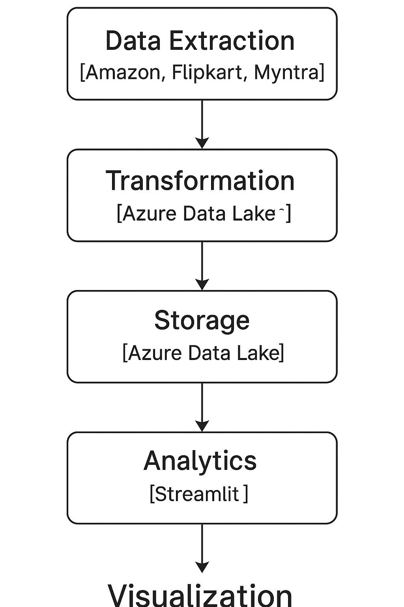

# price-intelligence-datalake

# 🧠 Competitive Price Intelligence Data Lake

An end-to-end data engineering project that ingests, cleans, analyzes, and visualizes **e-commerce pricing data** from multiple sources.  
This pipeline helps businesses identify optimal product prices based on competitor trends using **Python, Azure Data Lake, and Streamlit**.

---

## 🧩 Architecture Overview

  

### Workflow
1. **Extract** – Collect pricing data from multiple e-commerce sources.  
2. **Transform** – Clean, merge, and deduplicate data using Pandas.  
3. **Load** – Upload results to Azure Data Lake or local storage.  
4. **Analyze** – Generate pricing recommendations using rule-based or ML models.  
5. **Visualize** – Display interactive insights in a Streamlit dashboard.

---

## 🛠️ Tech Stack

| Layer | Tool / Library |
|-------|----------------|
| Ingestion | Python, Requests, BeautifulSoup |
| Processing | Pandas, NumPy |
| Orchestration | Airflow / Cron |
| Storage | Azure Data Lake / Blob Storage |
| Visualization | Streamlit |
| Analytics | Scikit-Learn (optional for future ML models) |

---

